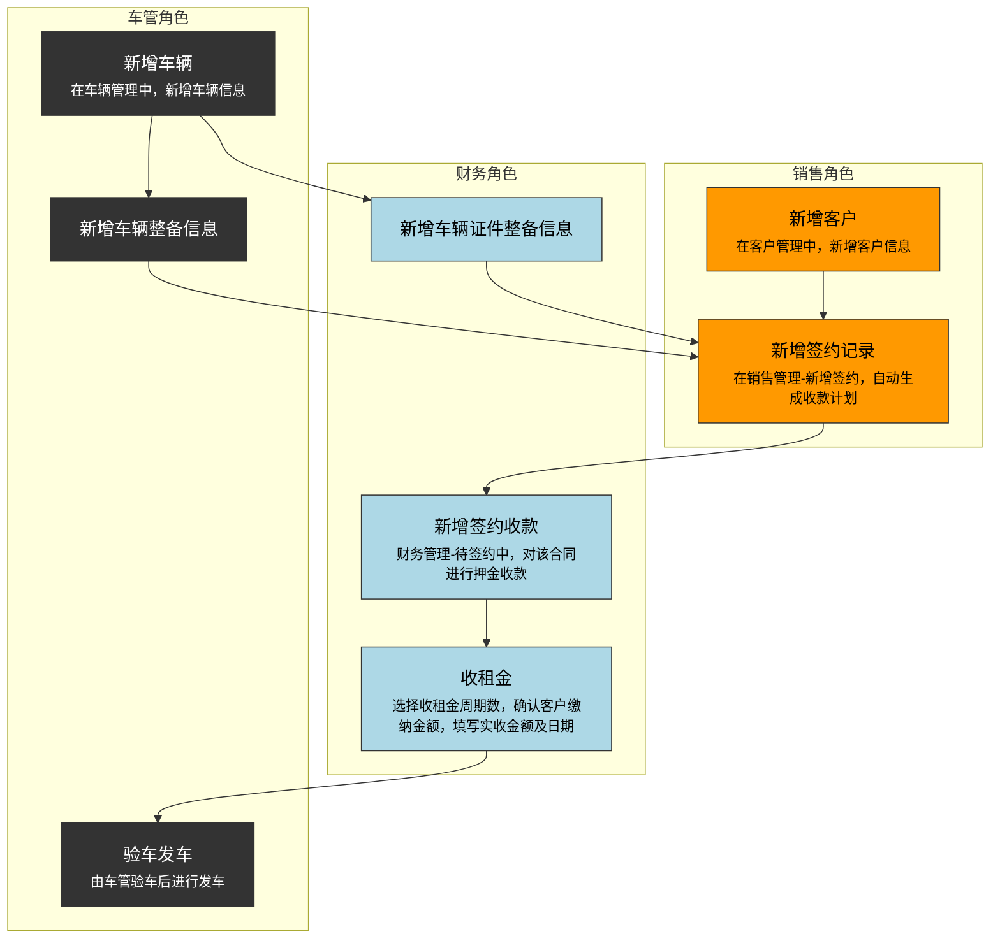

# 租车流程

## 流程图

以下流程图从销售、财务、车管三个角色出发，梳理了从新增客户到发车验车的关键节点，可作为新员工入职培训或流程稽核的参考。

```mermaid
%%{init: { "theme": "default", "themeVariables": { "fontFamily": "Arial" }}}%%
flowchart TB
  %% —— 销售角色泳道（最上方） ——
  subgraph 销售角色["销售角色"]
    direction LR
    %% “标题行+说明行”分别设置大小
    SA["<div style='font-size:18px;line-height:2.0;'>新增客户</div><div style='font-size:14px;'>在客户管理中，新增客户信息</div>"]
    SB["<div style='font-size:18px;line-height:2.0;'>新增签约记录</div><div style='font-size:14px;'>在销售管理-新增签约，自动生成收款计划</div>"]
    SA --> SB
  end

  %% —— 财务角色泳道（中间） ——
  subgraph 财务角色["财务角色"]
    direction LR
    FA["<div style='font-size:18px;line-height:2.0;'>新增车辆证件整备信息</div><div style='font-size:14px;'></div>"]
    FB["<div style='font-size:18px;line-height:2.0;'>新增签约收款</div><div style='font-size:14px;'>财务管理-待签约中，对该合同进行押金收款</div>"]
    FC["<div style='font-size:18px;line-height:2.0;'>收租金</div><div style='font-size:14px;'>选择收租金周期数，确认客户缴纳金额，填写实收金额及日期</div>"]
    SB --> FB
    FB --> FC
  end

  %% —— 车管角色泳道（最下方） ——
  subgraph 车管角色["车管角色"]
    direction LR
    MA["<div style='font-size:18px;line-height:2.0;'>新增车辆</div><div style='font-size:14px;'>在车辆管理中，新增车辆信息</div>"]
    MB["<div style='font-size:18px;line-height:2.0;'>新增车辆整备信息</div><div style='font-size:14px;'></div>"]
    MC["<div style='font-size:18px;line-height:2.0;'>验车发车</div><div style='font-size:14px;'>由车管验车后进行发车</div>"]
    MA --> MB
  end

  %% —— 跨泳道箭头 ——
  %% ↑ 销售 -> 财务，财务 -> 车管 ↑
  MB --> SB
  MA --> FA
  FC --> MC
  FA --> SB

  %% —— 各泳道节点配色 ——
  classDef 销售 fill:#f90,stroke:#333,color:#000;
  classDef 财务 fill:#add8e6,stroke:#333,color:#000;
  classDef 车管 fill:#333,stroke:#333,color:#fff;

  class SA,SB 销售
  class FA,FB,FC 财务
  class MA,MB,MC 车管


```
