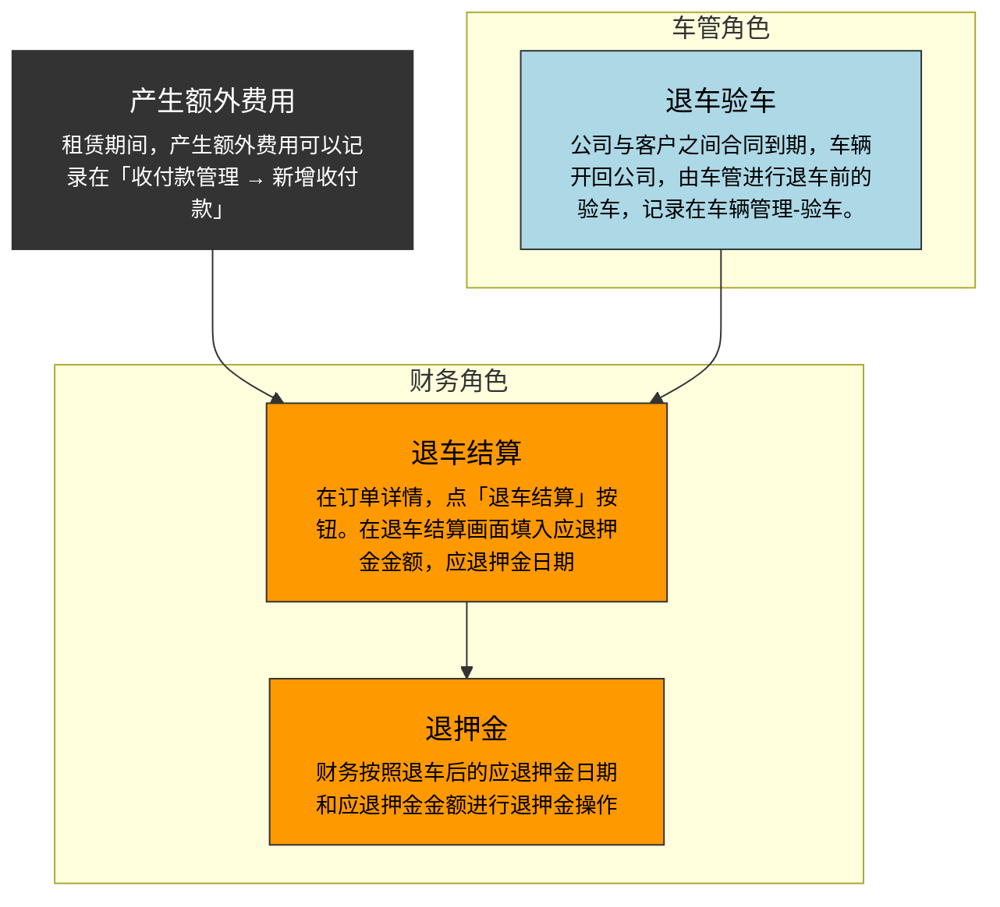

# 退车流程

```mermaid

flowchart TB

%% —— 泳道 ——
  MA["<div style='font-size:18px;line-height:2.0;'>产生额外费用
</div><div style='font-size:14px;'>租赁期间，产生额外费用可以记录在「收付款管理 → 新增收付款」</div>"]

%% —— 车管角色泳道 ——
  subgraph 车管角色["车管角色"]
    direction LR
    FA["<div style='font-size:18px;line-height:2.0;'>退车验车
</div><div style='font-size:14px;'>公司与客户之间合同到期，车辆开回公司，由车管进行退车前的验车，记录在车辆管理-验车。</div>"]
  end

  %% —— 财务角色泳道（最上方） ——
  subgraph 财务角色["财务角色"]
    direction LR
    SA["<div style='font-size:18px;line-height:2.0;'>退车结算</div><div style='font-size:14px;'>在订单详情，点「退车结算」按钮。在退车结算画面填入应退押金金额，应退押金日期</div>"]

    SB["<div style='font-size:18px;line-height:2.0;'>退押金
</div><div style='font-size:14px;'>财务按照退车后的应退押金日期
和应退押金金额进行退押金操作</div>"]
    SA --> SB
  end


  %% —— 跨泳道箭头 ——

  MA --> SA
  FA --> SA


  %% —— 各泳道节点配色 ——
  classDef 销售 fill:#f90,stroke:#333,color:#000;
  classDef 财务 fill:#add8e6,stroke:#333,color:#000;
  classDef 车管 fill:#333,stroke:#333,color:#fff;

  class SA,SB 销售
  class FA,FB,FC 财务
  class MA,MB,MC 车管


```
