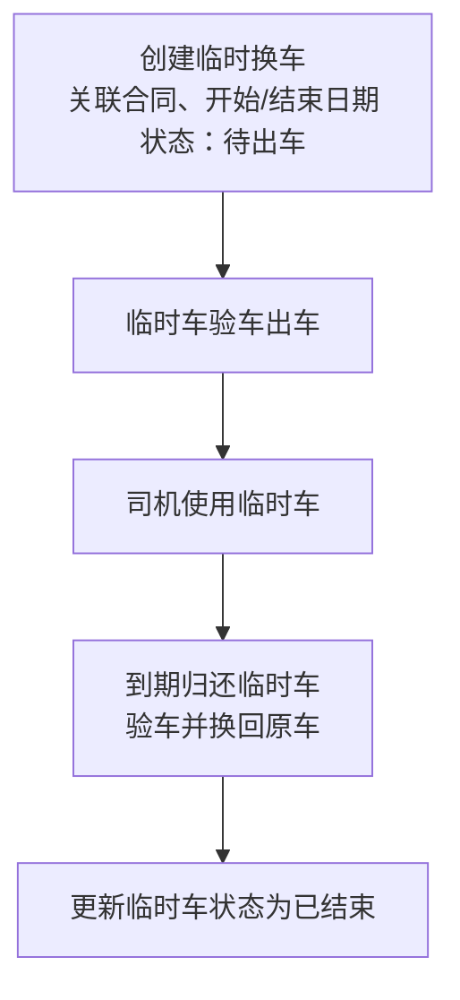

# 临时换车

当维修时间较长且影响司机出车时，可为司机临时分配一辆替代车辆，减少等待并保持运营。

## 操作流程

1. 创建临时换车：选择关联合同，设定开始/结束日期，状态置为“待出车”。
2. 临时车验车出车，司机接车使用。
3. 到期归还临时车，完成验车并换回原车。
4. 更新临时车状态为“已结束”。

## 流程图

## 补充说明

- 原合同不做变化。
- 司机在使用临时车过程中产生的违章仍关联到原合同。
- 换车的动作应有合同支持。
- 换车动作由谁发起（销售/车管），包括开始与结束的触发方。？
