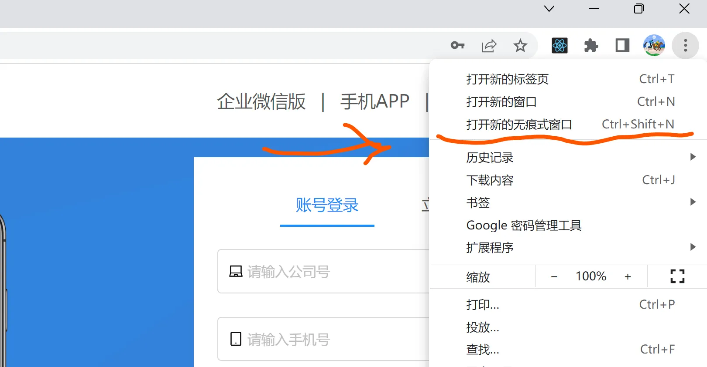
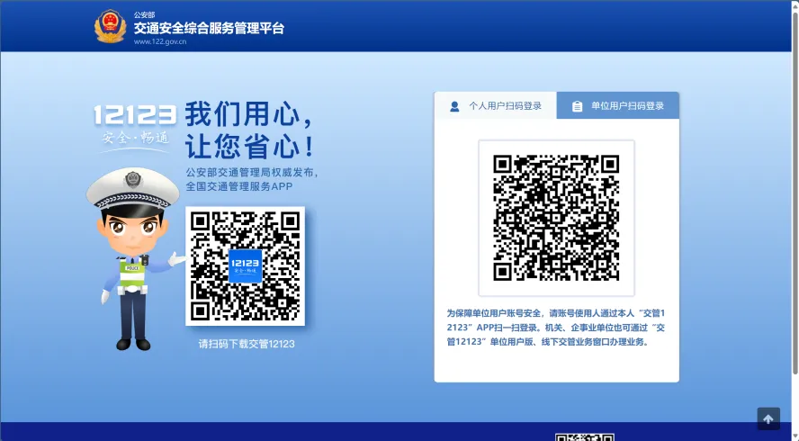
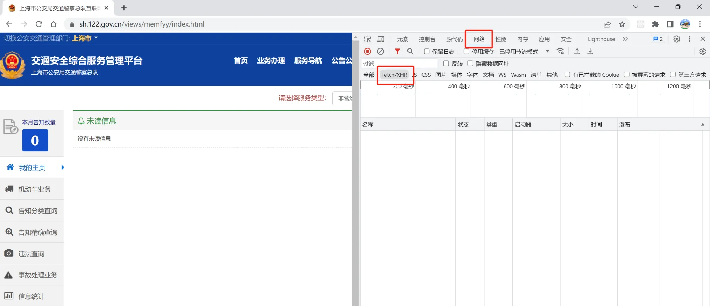
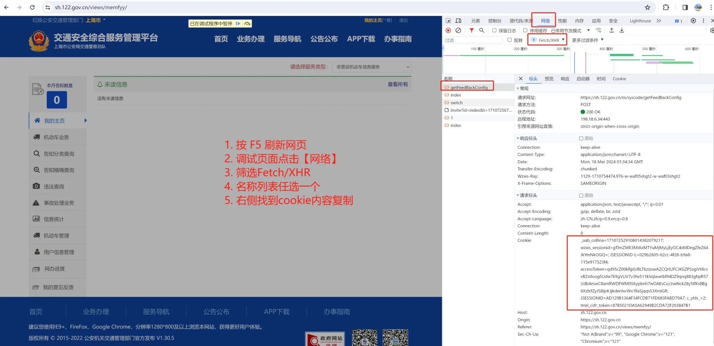
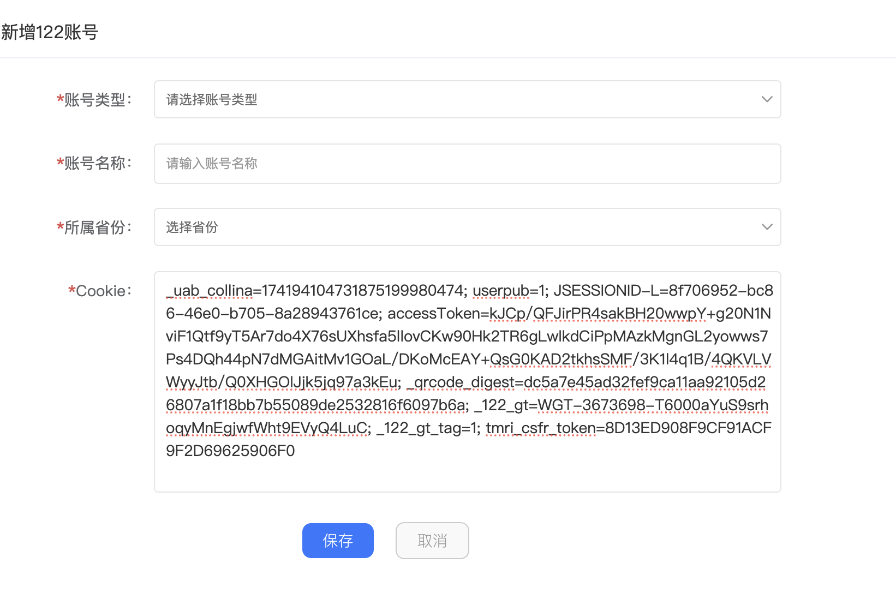

# 122 账号设置

在「智行租赁」中绑定 https://gab.122.gov.cn/m/login 账号后，系统即可自动导入车辆列表及违章信息，避免人工登录与导出。请确保仅查询并同步本公司的车辆数据。

## 如何获取 Cookie

要完成绑定，需要先获取交管网的登录 Cookie：

1. 使用电脑浏览器访问交管网，选择【单位登录】，然后在交管 12123 APP 中扫码确认。（如需登录多个单位账号，请务必使用 Chrome 无痕模式或 Edge InPrivate 窗口。）  
     
     
   
2. 登录成功后，按 `F12` 或在页面上点击右键选择【检查】，在开发者工具中切换到【网络】→【Fetch/XHR】面板。  
   
3. 在请求列表中选中任意接口，复制请求头中的 `Cookie` 全部内容。  
   
4. 返回智行租赁后台，将复制的 Cookie 粘贴到 122 账号配置页的输入框中即可。复制完成后可直接关闭交管网页，不要点击页面上的【退出】，否则 Cookie 会立即失效，需要重新操作。  
   

## 新增 122 账号后

1. 系统会自动监控并延展 Cookie 有效期，无需手动维护。
2. 每日定时查询违章与车辆列表，并写入系统台账。
3. 违章会按时间匹配发车/退车验车记录，自动关联到对应租赁订单与司机，方便追责与通知。
