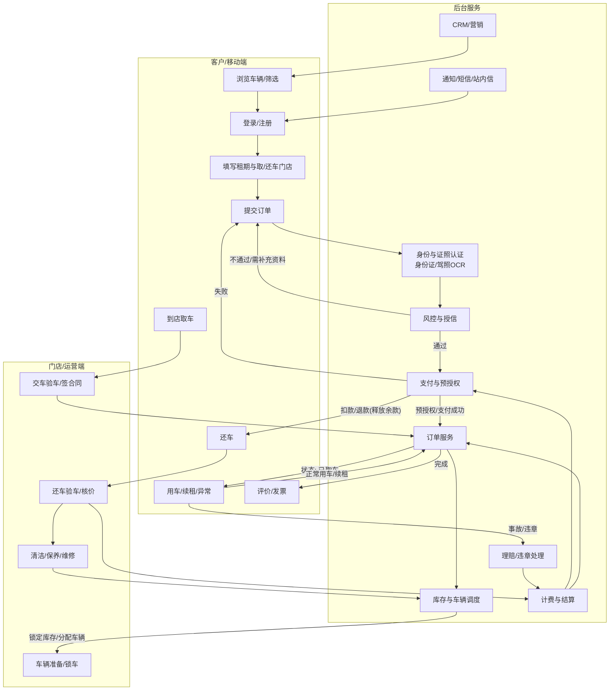
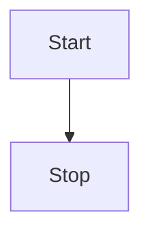
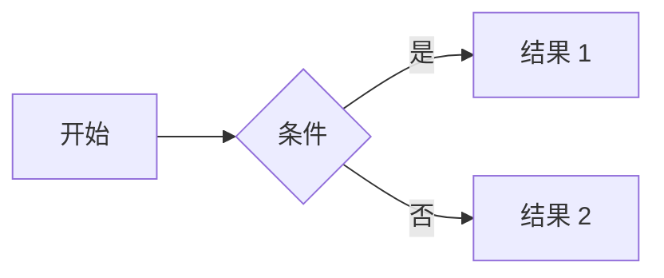
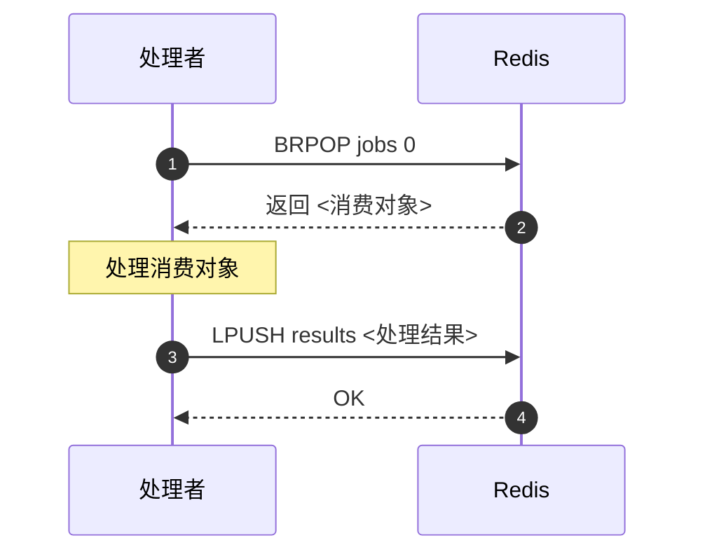

# Markdown 扩展示例



本页演示 VitePress 内置的部分 Markdown 扩展能力，便于在文档中插入流程图、代码高亮以及提示容器等元素。







## 代码高亮

VitePress 基于 [Shiki](https://github.com/shikijs/shiki) 提供丰富的代码高亮，并支持标记行号、行高亮等特性：

**Input**

````md
```js{4}
export default {
  data () {
    return {
      msg: 'Highlighted!'
    }
  }
}
```
````

**Output**

```js{4}
export default {
  data () {
    return {
      msg: 'Highlighted!'
    }
  }
}
```

## 自定义提示容器

**Input**

```md
::: info
This is an info box.
:::

::: tip
This is a tip.
:::

::: warning
This is a warning.
:::

::: danger
This is a dangerous warning.
:::

::: details
This is a details block.
:::
```

**Output**

::: info
This is an info box.
:::

::: tip
This is a tip.
:::

::: warning
This is a warning.
:::

::: danger
This is a dangerous warning.
:::

::: details
This is a details block.
:::

## 更多

想了解全部扩展语法，可参考官方文档的[Markdown 指南](https://vitepress.dev/guide/markdown)。
